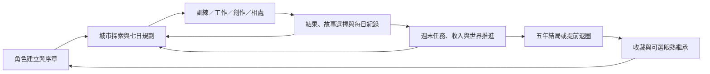

# 星途未定：像素唯一版本功能深度介紹

版本：核心 1.41.2／Pixel 0.18.2。整理日期：2026-09-07。此文件依目前的程式規則、實際畫面與回歸案例整理；「支援」表示存在可執行流程，不表示已人工通關每一條隨機分支。

## 1. 遊戲現在的完整循環

玩家從建立角色開始，在星望市以每週七天安排訓練、工作、創作、交友和生活。正式行動會消耗一天，依條件扣費、檢查人物檔期並結算結果；週末回顧再推進世界、任務、公司與人物故事。累積五年後結算作品、職涯和關係，也可提前退圈，進入下一輪人生。

目前是本機單人遊戲。NPC 有規則化行程、關係狀態和編寫好的事件；自由文字訊息使用主題、關鍵字和既有記憶挑選回覆。沒有雲端帳號、自動跨裝置同步、真人多人互動或無限生成劇情。

### 時間與資源的操作邊界

| 操作 | 時間成本 | 實際作用與限制 |
|---|---|---|
| 打開手帳、看資料、搜尋、看地圖 | 不占主要行動日 | 閱讀及規劃；不會因看過內容就得到作品或人脈成果 |
| 在場景走動、查看家具、切換鏡頭 | 不直接推進天數 | 可移動、接觸服務與 NPC；真正安排並結算的活動才產生成果 |
| 調整未來行程、申請、選製作方向與團隊 | 通常是即時規劃 | 不能用助手覆蓋已完成日或已保留的正式約定；部分變更有狀態限制 |
| 上課、打工、自由活動、正式試鏡、製作、相聚 | 占一天 | 依行動檢查資格、費用、資源及檔期；選項可能改變成果 |
| NPC 短訊／短通話 | 不占主要行動日 | 每位 NPC 每週最多 2 次、全體合計最多 5 次；不是無限刷關係 |
| 買家具／材料／服裝、套用已擁有造型 | 即時操作 | 購買扣遊戲金錢；試穿只預覽，不能取得未購服裝的能力收益 |
| 作手作、到家相處、重要日子赴約、遛寵物、對戲 | 占一天 | 必須排入可用日期，按該活動的條件結算 |
| 1×、2×、4×、8×、16× | 改變演出速度 | 不改變天數成本、獎勵或成功判定 |
| 開選單、閱讀選項、隱藏分頁 | 暫停相關演出 | 選項未決定前不會替玩家完成決策 |

## 2. 建立角色、身分與序章

**可以做的行為**：選擇性別與外型、設定本名和選填藝名、設定生日、重擲 21 項初始能力，正式開始後逐幕閱讀或跳過序章，並選擇初始志向。志向提供開始方向，不鎖死後續職涯。

目前有四種外型：夜櫻系、暖杏系、夜墨系、春茶系；每個性別各兩種。初始公開能力各為 0–150。名字、生日等設定會存成草稿；Escape 不會完成角色，只有「開始我的一天」會同步名字、鎖定身分並進入序章。

開始後可修改本名／藝名、切換同一性別外型。跨性別外型需前往診所，確認並支付遊戲內 $60,000；既有服裝收藏保留。外觀資源載入失敗時回復原狀，不應扣款或保存一半的外觀。

**深度與限制**：這是有持續身分、生日、能力起點及序章進度的角色建立流程；目前沒有臉型滑桿、逐件配件編輯或任意上傳人物圖片。

依據：[建立角色](https://github.com/iewiepeity/star-game/blob/main/src/pixel/onboarding.js)、[身分規則](https://github.com/iewiepeity/star-game/blob/main/src/pixel/identity.js)。

## 3. 城市探索、場景與人物演出

城市地圖目前有 27 個主要入口、32 個可定義空間，涵蓋住處、排練室、咖啡館、電視台、影業、唱片、舞蹈、健身、商務中心、四家經紀公司及特殊室內空間。部分空間透過建築內相連入口或劇情條件開放，並非開局全部無條件可達。

可以點地面走路，使用方向鍵或 WASD，拖曳鏡頭、縮放及找回主角；也能從「附近物件」選家具或人物，角色先走近才互動。家具支援相應姿勢及部分外觀選項；回家按鈕能中止目前路線並返回住處。NPC 會依行程移動、活動或離開，正式約定會保留人物檔期。

面對面主線能演出角色入場、走位、面向、分幕對話、玩家選擇與離場；讀檔可接續演出進度。重要決策的效果由遊戲規則結算，跳過動畫不會跳過選項或重複領取成果。

**深度與限制**：探索可以連接到實際服務、任務、正式相遇與故事；場景不是可任意建造的沙盒，NPC 也不是即時生成行動的真人角色。插畫及故事演出沿用編寫素材，沒有全劇語音配音。

依據：[城市資料](https://github.com/iewiepeity/star-game/blob/main/src/pixel/data.js)、[世界](https://github.com/iewiepeity/star-game/blob/main/src/pixel/world.js)、[故事導演](https://github.com/iewiepeity/star-game/blob/main/src/pixel/story-director.js)。

## 4. 七日行程、助手與自動執行

從第一週即可排七天。現有 58 個行程類型識別，涵蓋生活、訓練、零工、探索，以及帶工作／人物／作品參數的正式行動；這個數字不是 58 個彼此完全獨立的遊戲系統。

**可以做的行為**：逐日選行動、查看禁用原因、開始今天的行動、取消尚未結算的行動、查看今日結果、進入明天、週末回顧，以及自動執行已規劃的行程。已經結算的日子不能取消或重做；停止自動行程不會額外送出獎勵。

助手提供五種範本、沿用上週、例行安排改休息、待辦通告優先及一次復原。待辦通告僅使用休息／公園空檔；正式通告、作客、城市邀約及已完成日期受保護。復原限於助手操作後狀態仍相容，若金錢、關係、作品或預約已改變，會拒絕用舊快照覆蓋。

三種本週策略會影響之後的結算：能力成長、增加曝光、拓展人脈。行動進行中不能切換策略來改寫該次成果。手機改為兩欄日卡，仍保留七天總覽與單日選擇。

**深度與限制**：這是有資源、人物檔期和期限約束的排程系統；助手不保證自動找到五年最佳路線，也不會替玩家做所有故事選擇。

依據：[行程生命週期](https://github.com/iewiepeity/star-game/blob/main/src/pixel/life.js)、[排程助手](https://github.com/iewiepeity/star-game/blob/main/src/pixel/planner-tools.js)。

## 5. 能力、健康、費用與每週目標

21 項公開能力分為「表演」「創作」「形象」「社交與知識」四組；畫面顯示基礎／有效能力、服裝加成與娛樂圈評價。另有 8 項隱藏特質及運氣，介面以線索與「尚待觀察」呈現，不直接公開隱藏數字。

健康、心情、體力、疲勞不是同一個數值；各行動有不同費用、成長與恢復。資金不足時不能執行高於現金的安排；過度疲勞或強制休養週會限制活動。能力頁目前以四個狀態格和可見進度條呈現身體狀態。

新人第一週目標為探訪一次與職涯活動一次，並在週末保持疲勞不高於 60。之後可透過「訓練兩天＋職涯一天」或「職涯三天」等組合達成；第九週起增加生活搭配選項。達成條件依實際完成活動判定，單純排上行程不算領到獎勵。

資金低於 $1,500 時有一次救急短工，可得 $3,000；不能反覆領取。這是低資金救急安排，並非無限制補助。

**深度與限制**：玩家可在能力、曝光、人脈和休養間取捨；目前數值與任務遵循既定規則，不能把實際養成路線宣稱為完全平衡或每種策略等強。

依據：[每週任務](https://github.com/iewiepeity/star-game/blob/main/src/logic/weekly-task.js)、[能力資料](https://github.com/iewiepeity/star-game/blob/main/src/data/abilities.js)。

## 6. 工作、徵選與正式通告

工作涵蓋零工與正式作品。零工可先協助收入及準備；正式工作有可見機會、資格、試鏡、通過、簽約、製作中、完成或逾期等階段。

**可執行流程**：到公司或看板取得機會 → 搜尋／篩選工作 → 查看條件、報酬與檔期 → 登記 → 選一天試鏡 → 做出試鏡選擇 → 通過後簽署工作 → 安排一次或多次通告 → 累積製作並結算作品。未通過、失效或檔期不足都有相應狀態；不是點一次申請就立即完成作品。

正式工作會檢查能力、開放條件、人物共同檔期與期限。簽約公司抽成會影響實際收入。完成作品進入履歷、職涯進展和評選資料；部分後續機會、續作及海外發展依已有進度開放。

**深度與限制**：這是完整的職涯流程與資源循環；不支援任意自訂雇主、自由輸入合約條款或在不符合條件時強行接案。每項工作內容及市場變化仍是資料與規則驅動。

依據：[職涯預約與結算](https://github.com/iewiepeity/star-game/blob/main/src/pixel/career.js)、[工作規則](https://github.com/iewiepeity/star-game/blob/main/src/logic/job-engine.js)。

## 7. 經紀公司、談判與經紀人

四家經紀公司各有簽約準備度、能力門檻、年限、抽成及資源偏好：星光藝能、映界文化、澄音娛樂、浪潮媒體。

可以查看不足條件、投遞履歷、等待次週面談回覆、安排面談、選擇回答、接受或婉拒合約，以及符合條件時續約。條款可針對降低抽成、縮短年限、創作自主、保證試鏡進行既定談判。經紀人會談與危機溝通可以排入行程，回應會影響信任、壓力、默契或準備效果。

| 公司 | 基礎合約年限 | 基礎抽成 | 傾向 |
|---|---:|---:|---|
| 星光藝能 | 104 週 | 20% | 戲劇、廣告、綜藝均衡 |
| 映界文化 | 104 週 | 18% | 演員、劇本與作品 |
| 澄音娛樂 | 156 週 | 25% | 音樂、偶像、密集資源 |
| 浪潮媒體 | 78 週 | 22% | 綜藝、新媒體、個人品牌 |

上表是資料中的基本條件，實際畫面可能反映談判或續約結果。

**深度與限制**：公司選擇具有長期條件差異；不是純換名稱。談判是有限選項與規則判定，不是可以任意撰寫、自由議價的合約編輯器。

依據：[公司資料](https://github.com/iewiepeity/star-game/blob/main/src/data/agencies.js)、[公司流程](https://github.com/iewiepeity/star-game/blob/main/src/logic/agency.js)、[條款談判](https://github.com/iewiepeity/star-game/blob/main/src/logic/contract-negotiation.js)。

## 8. 原創作品：從草稿到市場回響

可製作歌曲 Demo、影視劇本和節目企劃。每份作品有名字、方向、進度、品質、修改次數、投稿紀錄、製作團隊、預算、發行結果及故事紀錄。

**完整可做的路徑**：

1. 建立並命名企劃，選擇創作方向，安排多個創作日累積草稿。
2. 草稿完成後可修改、投稿公司、出售企劃權利，或選自主製作。
3. 投稿可能接受或拒絕；拒絕後能再修訂。出售權利取得一次收入並結束自己的主導路線。
4. 簽約或自主製作後可挑選符合專業、關係與檔期條件的合作者，分配角色、選擇親自演出或幕後主創。
5. 安排製作日，完成後另排發行，產生收入、名氣、粉絲、評價與正式作品紀錄。

目前三種預算為精簡 $0、標準 $3,500、高規 $9,000，製作開始後不能再改預算。每份作品最多三位主要 NPC 合作者；有尚未執行的團隊製作預約時，需先取消排期再改團隊。已出售或發行作品不能繼續當成草稿修改。

**深度分析**：這是目前最完整的多階段系統之一。方向影響使用的能力，隊伍專業、關係和預算影響製作品質，自主與公司合作又影響成本、權利和收益。作品有長期履歷及市場後果，而非只加一個「創作」數值。

**實際限制**：不會真的生成可播放的歌曲、影片或完整劇本檔；玩家是在模擬作品開發與發行。投入高預算並不保證最高評級。

依據：[創作狀態與結算](https://github.com/iewiepeity/star-game/blob/main/src/logic/creative.js)、[團隊與預算](https://github.com/iewiepeity/star-game/blob/main/src/logic/creative-team.js)。

## 9. 人物、訊息與關係

城市目前有 11 位具名 NPC。玩家可以先在場景相遇、建立聯絡，再看人物檔案、背景、喜好、關係網、共同記憶、訊息與故事進度。人物在場景的出現與正式約定受到行程影響。

短訊／短通話提供空檔互動：可以選主題，也可輸入 1–200 字；關懷與工作相關字詞會影響回覆主題，過去城市生活記憶也可能被提起。每人每週限兩次、全體五次，敵意過高時對方會拒絕聯絡。更完整的聊天、約會、合作或相聚則需安排一天。

關係不只有好感：親近、信任、心意、敵意、故事階段及共同經歷會共同影響後續。重複見面不再算初識；單純打開檔案不會獲得關係成果。

**深度與限制**：人物有跨週持續記憶與有限主動事件。任意輸入文字不會創造新的世界事實；回覆來自既定主題、關鍵字與素材，不是無限聊天系統。

依據：[短聯絡](https://github.com/iewiepeity/star-game/blob/main/src/logic/short-contact.js)、[人物互動](https://github.com/iewiepeity/star-game/blob/main/src/logic/npc-interaction-engine.js)。

## 10. 戀愛、衝突與人物故事

一般戀愛狀態可以從在意、曖昧、交往，進到穩定伴侶、訂婚與已婚；也有未被接受及分手狀態。關係推進不是只看單一數字，還檢查親近、信任、心意、等待週數、作品與當前工作關係。

例如交往後進到穩定伴侶至少要經過八週；穩定伴侶到訂婚、訂婚到結婚各有進一步時間與關係門檻。需要正式事件和玩家回應，不會因看到按鈕或讀取舊選項就自動成立。可以選擇公開／地下戀，提出分手前有確認，嚴重衝突也可能造成關係破裂和鑰匙失效。

11 位 NPC 不等於 11 條同樣開放的普通戀愛線：秦紹謙目前是職涯信任與友誼線，沈霧棠使用多周目隱藏敘事條件，不能當成一般戀愛按鈕路線介紹。其他人物也各有條件與衝突限制。

主線、長篇、邀約、隱藏章節與多人事件是作者編寫的分支內容。面對面事件可以分幕演出；初識訊息、來信與已完成回顧保留通訊／收藏形式。選擇可能改變關係、後續事件和回憶，並保留在進度裡。

**深度與限制**：支援長期關係、拒絕與修復，不是一次送禮就完成戀愛。一般婚戀、特殊隱藏劇情及純友誼線的能力不同，不應籠統宣稱每個 NPC 都能結婚。

依據：[戀愛條件](https://github.com/iewiepeity/star-game/blob/main/src/logic/romance-engine.js)、[路線資料](https://github.com/iewiepeity/star-game/blob/main/src/data/romance.js)、[故事流程](https://github.com/iewiepeity/star-game/blob/main/src/pixel/story-director.js)。

## 11. 居家生活：布置、作客、手作、紀念與鑰匙

### 布置

五個固定位置為床、窗簾、沙發、牆面與桌上擺飾，共有 14 件家具資料（含初始物件）。可以購買、切換已擁有的布置，並在住處場景看到對應呈現。這是固定位置配置，不是任意拖拉家具、改建房屋或自由室內設計。

### 作客

可邀請已認識、關係適合的人到家裡吃晚餐、對戲、聽試錄音或看電影。一般需要親近至少 20，或已是伴侶，並且沒有高度敵意；同一人物每週最多一次作客。要保留雙方日期，實際相處才增加親近與信任，並留下作客、首次紀念及後續訊息。人物能注意到房間裡展示的相關紀念品。

### 手作與贈禮

三種材料包支援四種配方：可可星星餅乾、深夜暖胃飯盒、小小星願吊飾、手寫歌詞卡。玩家先補材料，再排手作日，取得具有品質及狀態的成品，可自用或送給合適對象；贈禮反應會參考喜好與重複贈送紀錄。保留中的成品上限為 100，滿了要先使用或送出。

### 紀念與鑰匙

可以查看作品／人物相關紀念，選擇展示一件或留白。備用鑰匙可交付與收回；需親近至少 65、信任至少 55、敵意低於 45 且未分手。條件失效時鑰匙會失效；交出鑰匙本身不作為無限好感獎勵。

**深度分析**：居家生活已連到人物記憶、後續聯絡、行程及場景呈現，而非獨立裝飾選單。可做的物件與配方仍是有限清單，沒有自訂配方或完全自由料理。

依據：[居家資料](https://github.com/iewiepeity/star-game/blob/main/src/data/home-life.js)、[居家規則](https://github.com/iewiepeity/star-game/blob/main/src/logic/home-life.js)、[鑰匙狀態](https://github.com/iewiepeity/star-game/blob/main/src/core/home-state.js)。

## 12. 城市日常的五種延伸

| 子功能 | 現在可以做什麼 | 條件與深度邊界 |
|---|---|---|
| 日曆與重要日子 | 查生日、跨年、已記錄的交往紀念日，邀請、改期、取消、赴約 | 可前後一週補過；赴約占一天、聚會 $300；檢查關係及雙方檔期，無日期的舊紀錄不生成紀念日 |
| 場合穿搭記憶 | 在真正見面、作客或赴約時，讓朋友認出現在或以前穿過的造型 | 每人每日最多記一次；試穿不增加記憶，穿搭反應不是可無限刷的數值獎勵 |
| 熟客 | 在咖啡館、排練室、服飾店、公園、錄音室累積到訪，取得可排進行程的小消息 | 五個既有地點；看過地圖不等於完成到訪，同一機會不能重複使用或同時排兩天 |
| 寵物 | 選貓或狗、取名、回家迎接、短陪伴、排散步、安排出遠門託顧 | 一段旅程一隻；短陪伴每週一次心情收益；沒有每日漏餵懲罰。熟人託顧需關係與檔期，付費服務在實際出發時結算 |
| 對戲接話 | 安排三段選擇式練習，可跳過挑戰，完整三次後快速複習 | 是固定的三段練習與規則回饋；不是即時錄音、自由演技評分或無限新題 |

城市生活另有「那天之後」回響：作客、手作和赴約可產生稍後訊息，部分能再約成對戲日。合照要先徵詢、同意後再由玩家決定公開；可收回分享。私人回憶不會自動公開成八卦，公開照片也不等於自動宣布戀愛。

日曆採遊戲的一年 52 週，年末生日落在最後一天、2 月 29 日在 2 月 28 日慶祝；這是遊戲日曆安排，不是逐日真實公曆模擬。

依據：[城市日常規則](https://github.com/iewiepeity/star-game/blob/main/src/logic/city-life.js)、[邀約排程](https://github.com/iewiepeity/star-game/blob/main/src/pixel/city-schedule.js)。

## 13. 星語、論壇與娛樂圈

**星語**：可看動態與相關數據，對 NPC 貼文按讚／取消讚、展開留言、選回應，並安排正式貼文。正式貼文會占一天，由社群規則結算曝光等成果。文案可反映近期工作、創作、地點與團隊經驗。

**論壇**：可按分類、搜尋與排序查看討論串、讀留言，支持／反對／觀望及輸入回應內容，也能更新話題與查舊討論。討論與輿論是遊戲內資料，不會送到真實社群網站。

**娛樂圈**：提供週報、風向、競爭者、NPC 職涯、品牌、粉圈、輿論和作品後續等資訊。這些狀態可與工作報酬、機會、評價和作品生命週期連動，主要互動入口仍在工作、行程、作品或人物頁。

**深度與限制**：社群具備操作、成本及後果，娛樂圈頁偏向觀察與決策資訊。不能把「有品牌資訊」解讀成可自由談任何品牌，也不支援發布到真實外部平台。

依據：[功能操作](https://github.com/iewiepeity/star-game/blob/main/src/pixel/feature-ui.js)、[社群文案](https://github.com/iewiepeity/star-game/blob/main/src/logic/social-drafts.js)、[世界畫面](https://github.com/iewiepeity/star-game/blob/main/src/views/world.js)。

## 14. 衣櫃、收藏造型與能力比較

四個外型各有 15 套整體造型，可看所有／已擁有／分類、預覽穿搭、比較能力、購買、套用，以及保存三個常用造型槽。未購的服裝能試穿預覽，正式穿上仍需擁有；畫面立繪與場景小人會同步。

不同外型的收藏分開保存。跨性別變更不是在衣櫃直接切換，需使用診所流程。城市穿搭記憶記下真正穿著赴約的造型，不會把預覽當成實際事件。

**深度與限制**：有外觀、數值、收藏和人物記憶四層連動；服裝是整套造型，不是逐件混搭系統。

依據：[衣裝資料](https://github.com/iewiepeity/star-game/blob/main/src/data/wardrobe.js)、[衣櫃及保存操作](https://github.com/iewiepeity/star-game/blob/main/src/pixel/feature-ui.js)。

## 15. 手帳、紀錄、收藏與成就

手帳包含 17 個目的地，加上手帳本身的搜尋、分類、最近使用及六個常用捷徑。手機和桌機在同一世界內開啟功能，搜尋支援正常中文輸入法組字。

- **人生時間線**：搜尋與分類事件、讀重要轉折和訊息、標記已讀，跳到相關人物或功能。
- **生涯紀錄**：看正式作品、原創作品、作品後續、獎項、職涯與週誌。
- **影像館**：查看收藏進度、分類、已解鎖插畫及對應章節回顧。沒有解鎖的不等於素材丟失。
- **成就**：依分類查看目標、完成進度及已解鎖收藏。

**深度與限制**：紀錄主要是回顧、查閱及跳轉，不是時間倒帶；想回到先前狀態需讀取先前存檔。收藏與作品有不同判定，打開影像館不會直接解鎖所有 CG。

依據：[手帳目的地與操作](https://github.com/iewiepeity/star-game/blob/main/src/pixel/feature-ui.js)、[成就引擎](https://github.com/iewiepeity/star-game/blob/main/src/logic/achievement-engine.js)。

## 16. 五年結局、退圈與新周目

遊戲有 19 種結局原型，依作品、獎項、名氣、財務、評價、關係與重大選擇等判定；包含未完待續、站穩腳步、原創主導、商業、伴侶、完整人生等方向。到第 261 週代表五年結算完成，並不是第六年自由延長玩法。

可以查看結局評分、職涯方向、作品及個人化回顧；保存、查看作品、開始下一段人生的入口現在放在回顧文字之前。設定提供提前退圈確認，若仍有未完成的主要行動，需先完成或取消。

新周目重設金錢、作品、能力起點與人物關係，保留永久成就與結局收藏。已完成結局後可選眼熟印象；仍需重新見面、建立聯絡，不繼承好感、信任、金錢或作品。重開前有預覽，之前的旅程有備份。

**深度與限制**：結局是對多年選擇的評估，不只是單一通關分數。19 是已定義原型的數量，不表示此次驗證已人工完成 19 條路線；長期容量回歸使用固定種子的休息路線。

依據：[結局計算](https://github.com/iewiepeity/star-game/blob/main/src/logic/career.js)、[新周目與繼承](https://github.com/iewiepeity/star-game/blob/main/src/pixel/save-transfer.js)。

## 17. 存檔、復原與資料搬移

修復後的遊戲進度存於 IndexedDB，包含一個自動槽、五個手動槽、覆寫前備份、搬移前備份及刪除復原資料。既有像素 localStorage 檔案第一次啟動會自動遷移；確認資料交易完成後，才釋放內容相同的舊資料。歷史與玩家紀錄不為了本次容量修復而刪減。

| 情境 | 玩家現在可以做的操作 |
|---|---|
| 一般遊玩 | 自動保存，或在五個手動位置保存與讀取；覆寫已有位置需確認 |
| 儲存空間不可用／寫入失敗 | 看到失敗狀態，從存檔頁匯出目前記憶體中的旅程；不會顯示假的儲存成功 |
| 自動存檔損毀 | 先停止覆寫，可從有效自動備份復原、下載原始資料、載入手動檔或匯入檔案 |
| 復原完成 | 損毀原始資料保留為隔離副本，仍可從存檔頁下載 |
| 開了兩個遊戲分頁 | 新進度使舊分頁暫停；可先匯出舊分頁，再明確選擇接續最新進度 |
| 誤刪手動槽 | 從管理頁復原刪除；每槽保留最近一份刪除資料，不是無限回收桶 |
| 想回到上次覆寫前 | 使用該槽的覆寫備份；每槽不是無限版本歷史 |
| 換裝置／換瀏覽器 | 匯出 JSON，到另一端匯入，先看摘要再確認；匯入檔大小上限 16 MB |
| 舊版旅程 | 從同來源瀏覽器的舊版槽讀取，或匯入舊版匯出檔；不需要舊版介面 |

離開或隱藏頁面時會留下一份該分頁的暫存快照，避免立即重新整理早於非同步寫入完成；下次啟動仍需比對進度版本，不能安全接續的快照會保留在存檔頁供玩家選擇。暫存只用於離開頁面保護，日常槽位與備份使用 IndexedDB。

存檔和其備份以同筆交易處理；多分頁寫入在同一交易內比較版本，因此即使瀏覽器沒有 BroadcastChannel，舊版本仍不能靜默覆寫。通知功能用於讓玩家即時知道衝突。

**實際限制**：IndexedDB 仍由瀏覽器管理，不是無限空間或永久雲端備份。清除網站資料會清除進度；跨裝置依賴 JSON 搬移。正常保存應以畫面的「已儲存」為準，作業系統直接終止程式前尚未提交的變更仍可能未保存。

依據：[儲存實作](https://github.com/iewiepeity/star-game/blob/main/src/pixel/storage.js)、[搬移格式](https://github.com/iewiepeity/star-game/blob/main/src/pixel/save-transfer.js)、[回歸測試](https://github.com/iewiepeity/star-game/blob/main/tests/e2e/pixel-audit-fixes.spec.mjs)。

## 18. 設定、可讀性、聲音、離線與更新

有奶油晨光、櫻花手帳、鼠尾草庭院、紫藤微光、午夜星河五種配色；三種閱讀字級，音樂／音效音量、靜音、音效試聽、教學開關與重設、速度、暫停及鏡頭控制。配色、音量及字級是裝置設定，不會因換一個角色存檔而改成另一人的偏好。

音樂在首次互動後啟用，隱藏頁面時暫停。離線可先下載完整素材包，再離線重新載入與進入未曾去過的場景；此版本建置清單為 599 個檔案、約 109 MB。瀏覽器若清除快取，要重新下載素材。

有安裝到主畫面／獨立視窗的入口，實際行為取決於瀏覽器。更新需要先保存進度，再切換新版；保存失敗時保留更新等待狀態，讓玩家處理或重試。

**深度與限制**：這是可離線使用的網頁遊戲，沒有在本次新增原生桌面或手機安裝包。自動無障礙檢查與手機模擬已用於回歸，但不等於所有實機、讀屏器、弱網、耗電及音訊體驗都已逐一驗證。

依據：[裝置設定](https://github.com/iewiepeity/star-game/blob/main/src/pixel/preferences.js)、[離線與更新](https://github.com/iewiepeity/star-game/blob/main/src/pixel/offline.js)。

## 19. 三種現在就能成立的玩法組合

| 路線例子 | 可以串起的行為 | 需要自己取捨的地方 |
|---|---|---|
| 新人演員 | 表演／鏡頭訓練 → 零工與準備 → 徵選 → 簽約通告 → 作品 → 獎項與職涯 | 現金、疲勞、試鏡成功率、共同檔期及公司抽成 |
| 原創音樂人 | 建 Demo → 多天創作與修訂 → 投稿或自主製作 → 邀請團隊 → 製作發行 → 市場與履歷 | 品質、預算、權利選擇、團隊信任及檔期 |
| 生活與關係 | 相遇 → 短訊 → 正式相處 → 作客／手作 → 重要日子 → 共同記憶與伴侶進展 | 不能無限刷聯絡、人物意願、關係門檻與時間、生活與職涯的日期分配 |

三條路線可交錯。這些是由現有操作組成的玩法示例，不保證固定結局，也不是自動最優通關攻略。

## 20. 深度總評

- **有完整流程與結果的系統**：七日排程、正式職涯、原創製作、公司申請與合約、存讀檔／資料搬移、新周目。
- **具有長期狀態、但受內容及門檻限制的系統**：人物關係、普通婚戀、人物／隱藏故事、居家相處、城市邀約與回響。
- **以觀察、回顧與收藏為主的系統**：娛樂圈資訊、能力資料、影像館、時間線、成就與生涯紀錄；它們能協助決策或回顧，並不全是獨立操作玩法。
- **刻意有限的日常系統**：四種手作、四種作客、五個熟客地點、一隻寵物、三段對戲題目、整套服裝。現在已與主要系統互相連動，但內容量有明確範圍。

這一版的核心深度來自「有限的每週時間，對作品、資源、人物與生活產生持續影響」。本輪修復改善保存可靠性、輸入及閱讀；沒有把尚未存在的無限對話、自由建造或雲端同步列為已完成功能。
